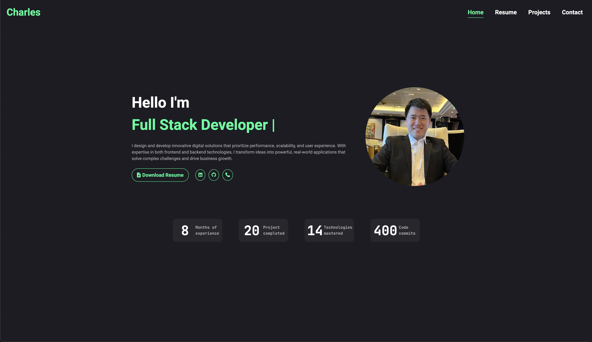

# Charles Nguyen - Developer Portfolio
Welcome to my portfolio! 🚀 This website showcases my journey, skills, and projects as a passionate Full-Stack Developer. My goal is to design and develop applications that combine technical precision with intuitive user experiences.


## How to Run the Portfolio Locally
1. Clone this repository:
```
git clone git@github.com:swe-thinhnguyen1701/myPortfolio.git
```
2. Navigate to the project directory:
```
cd myPortfolio
```
3. Install dependencies:
```
npm install
```
4. Run locally on your device:
```
npm run dev
```

## Contact Me
I’m always open to feedback, collaboration, or just connecting!
* Email: charles.nguyen1701@gmail.com
* LinkedIn: https://www.linkedin.com/in/thinh-nguyen-10b31a218/
* GitHub: https://github.com/swe-thinhnguyen1701